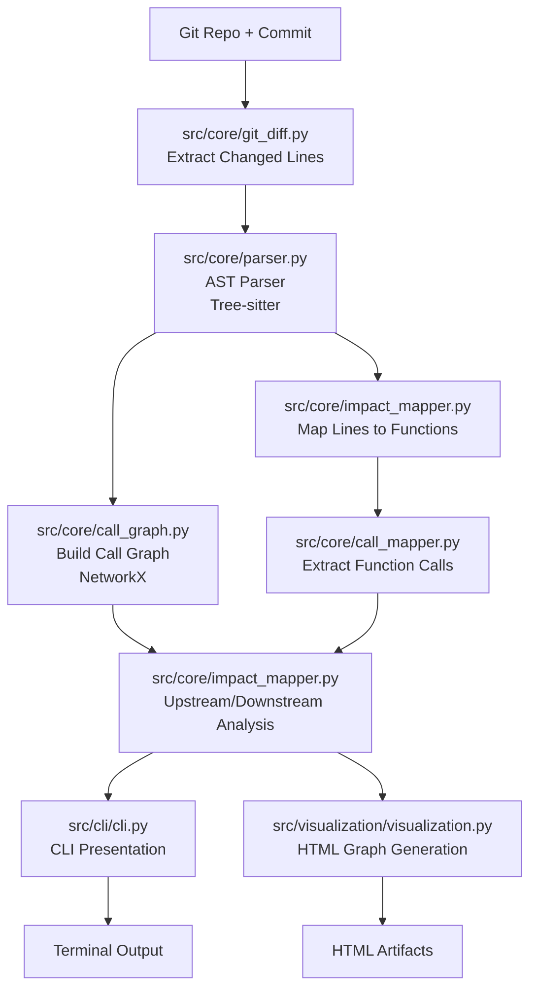

# ImpactScope

**ImpactScope** is a developer-first **Change Impact Analysis (CIA)** tool for large C codebases.

Given a Git commit (or diff), ImpactScope performs deterministic static analysis to answer a simple but expensive question:

> **For this change, what code is impacted — and what should I review or test?**

It bridges Git diffs, AST-level code structure, and call-graph analysis to compute the *blast radius* of a change.

---

## Why ImpactScope Exists

In large C projects, even small changes can have non-obvious downstream effects:

- A modified helper function may impact dozens of callers
- A seemingly local refactor can propagate across modules
- Running the full test suite is slow and often unnecessary

Industrial tools (e.g. certification-grade Change Impact Analysis systems) solve this problem, but are:

- Enterprise-focused
- GUI-heavy
- Closed-source
- Expensive and hard to integrate into modern CI workflows

**ImpactScope focuses on the same core problem, but with a developer-first mindset.**

---

## Current Capabilities

- Commit-aware change detection (Git diff parsing)
- Line-to-function mapping via AST (Tree-sitter)
- Function-level call graph construction
- **Downstream impact analysis** (functions called by a change)
- **Upstream impact analysis** (functions that call into a change)
- Depth-limited traversal to control noise
- Basic standard-library filtering
- CLI-first workflow
- Optional HTML call-graph visualization

---

## Installation

### Requirements

- Python **3.10+**
- Git
- A C repository to analyze

### Setup (recommended: `uv`)

```bash
uv sync
```

This installs dependencies from `pyproject.toml` and manages the virtual environment automatically.

### Testing

ImpactScope includes a comprehensive test suite covering the core static analysis functionality.

For development, install additional dependencies:
```bash
uv sync --extra test --extra dev
```

Run tests:
```bash
# Run the full test suite
uv run run_tests.py

# Or run directly with pytest
uv run pytest
```

The test suite covers:
- **Parser tests**: C code parsing, function extraction, call graph construction
- **Impact analysis**: Line-to-function mapping, upstream/downstream traversal
- **Git integration**: Diff parsing and commit analysis
- **Path utilities**: Cross-platform filename sanitization and URL generation

Alternatively, using a virtual environment:

```bash
python -m venv .venv
source .venv/bin/activate   # Linux / macOS
# or .\.venv\Scripts\Activate.ps1 on Windows
pip install -e .
```

---

## Usage

Run ImpactScope against a repository and a commit:

```bash
uv run -m src.main --repo-path ../your-c-project --commit HEAD
```

### Common options

- `--repo-path` *(required)*: Path to the target Git repository
- `--commit` *(required)*: Commit hash or ref to analyze
- `--depth` *(optional, default=1)*: Call graph traversal depth
- `--visualize` *(optional)*: Generate an HTML call graph under `artifacts/`
- `--output` *(optional, default=text)*: Output format — `text` for terminal-friendly output, `json` for machine-readable JSON

If a commit contains no relevant C changes, ImpactScope reports this explicitly.

### JSON Output

When using `--output json`, ImpactScope emits a structured JSON document suitable for CI, automation, and downstream tooling:

```bash
uv run -m src.main --repo-path ../your-c-project --commit HEAD --output json
```

**JSON Schema:**

```json
{
  "schema_version": "1.0.0",
  "repo_path": "../your-c-project",
  "commit": "HEAD",
  "depth": 1,
  "files": [
    {
      "file": "src/foo.c",
      "changed_functions": ["foo", "bar"],
      "downstream": ["baz", "qux"],
      "upstream": ["main"],
      "depth": 1,
      "changed_lines": [
        {"start": 10, "end": 15},
        {"start": 20, "end": 25}
      ]
    }
  ]
}
```

**Fields:**
- `schema_version`: Version of the output schema for compatibility tracking
- `repo_path`: Repository path that was analyzed
- `commit`: Commit hash or ref that was analyzed
- `depth`: Analysis depth used
- `files`: Array of per-file impact analysis results
  - `file`: Source file path relative to repository root
  - `changed_functions`: Functions directly affected by the commit
  - `downstream`: Functions potentially impacted downstream (called by changed functions)
  - `upstream`: Functions calling into the changed code
  - `changed_lines`: Line ranges that changed (optional, included when available)

### Example output

```text
src/auth/auth.c  Changed lines: [(5, 10)]
login_user
┣━━ Upstream (calls this function)
┃   ┗━━ handle_request
┗━━ Downstream (called by this function)
    ┣━━ connect_db
    ┣━━ printf
    ┗━━ query_user

src/net/net.c  Changed lines: [(3, 8)]
handle_request
┣━━ Upstream (calls this function)
┃   ┗━━ main
┗━━ Downstream (called by this function)
    ┣━━ login_user
    ┗━━ printf
```

This shows both **who depends on the changed function** (upstream) and **what it depends on** (downstream), giving a concrete view of how a change propagates through the system.

---

## Architecture Overview

ImpactScope processes C code changes in a structured pipeline, from diff analysis to impact visualization:




The pipeline flow:

1. **Git diff analysis** – Identify changed files and line ranges
2. **AST parsing** – Locate functions and call expressions using Tree-sitter
3. **Impact mapping** – Map changes to functions and propagate through calls
4. **Graph modeling** – Represent relationships using NetworkX
5. **Presentation** – Expose results via a clean CLI interface (and optional HTML graph)

## Code Organization

ImpactScope follows a modular architecture with clear separation of concerns:

### Core Analysis (`src/core/`)
- `parser.py` – Tree-sitter–based C parser for AST analysis
- `impact_mapper.py` – Maps code changes to functions and computes impact propagation
- `call_mapper.py` – Extracts function call relationships
- `call_graph.py` – Graph construction and analysis utilities
- `git_diff.py` – Commit-aware diff extraction and parsing
- `constants.py` – Shared constants and configuration

### Utilities (`src/utils/`)
- `path_utils.py` – Cross-platform path handling and filename sanitization

### Output (`src/output/`)
- `json_output.py` – JSON serialization and formatting for CI/automation

### CLI (`src/cli/`)
- `cli.py` – Command-line interface and user interaction

### Visualization (`src/visualization/`)
- `visualization.py` – Optional HTML call graph generation

---

## Design Philosophy

- **Determinism over magic**
- **Static analysis first, AI second**
- **Explainability over prediction**
- **Project-level reasoning over file-level diffs**
- **CLI and automation over GUI-heavy workflows**

This approach mirrors how industrial Change Impact Analysis tools are built, while remaining lightweight and developer-friendly.

---

## Documentation

For more detailed information, see our comprehensive documentation:

- **[Getting Started](docs/getting-started.md)** - Quick start guide and installation
- **[User Guide](docs/user-guide.md)** - Detailed usage instructions and examples
- **[API Reference](docs/api-reference.md)** - Complete CLI options and JSON schema
- **[Architecture](docs/architecture.md)** - Technical deep dive
- **[CI Integration](docs/ci-integration.md)** - Automation and CI/CD setup
- **[Visualization Guide](docs/visualization-guide.md)** - HTML call graph usage
- **[Contributing](docs/contributing.md)** - Development setup and guidelines
- **[Roadmap](docs/roadmap.md)** - Future directions and vision
- **[Troubleshooting](docs/troubleshooting.md)** - Common issues and debugging

---

## Future Directions

ImpactScope is currently an MVP focused on correctness, determinism, and architectural clarity.
The following items outline possible next steps and directions, based on review of industrial Change Impact Analysis tools and real-world workflows. They are intentionally non-binding and exploratory.

### Near-Term Extensions (Natural Next Steps)

These represent obvious follow-ups once deterministic impact data is available.

- Impact scoring and basic risk categorization (e.g. LOW / MEDIUM / HIGH)
- Human-readable summaries explaining why a change is risky
- Noise reduction heuristics to prioritize relevant impact paths
- Improved output formatting for CI and automation use

### Industry-Inspired Capabilities (Observed in Mature Tools)

Based on reviewing established CIA tools (e.g. certification-grade and enterprise systems), potential directions include:

- Change-based test selection and prioritization
- Baseline-to-baseline impact comparison
- Cross-module and system-level impact aggregation
- Lightweight traceability between changes, impact, and tests

These are not goals of the MVP, but provide context for how ImpactScope could evolve.

### AI-Assisted Enhancements (Optional & Assistive)

AI is considered only as a supporting layer, not part of core analysis.

Possible roles include:

- Explaining impact paths and propagation in natural language
- Suggesting review or testing focus areas
- Summarizing impact results for CI or pull request discussions

Beyond LLMs, learning-based approaches could be explored in the future:

- Learning which impact patterns are frequently low-risk vs high-risk
- Ranking or prioritizing impact paths based on historical data
- Assisting in noise reduction without removing deterministic results

AI components would operate strictly on top of structured output, not replace static analysis.

### Long-Term Outlook

If ImpactScope grows beyond MVP scope, longer-term directions may include:

- Data-flow or control-flow–aware impact propagation
- Scalable graph backends for large codebases
- Support for additional languages

**Positioning Note**

This roadmap is intended to show awareness and design thinking, not fixed commitments.
ImpactScope remains an MVP focused on building a correct, deterministic foundation before exploring advanced capabilities.

---

## Status

ImpactScope is currently a **working prototype** under active development.

The focus so far has been on **correctness, clarity, and architectural soundness** rather than feature completeness. The goal is to evolve ImpactScope into a **portfolio-grade Change Impact Analysis tool** that demonstrates:

- Static analysis fundamentals
- Call graph reasoning
- Deterministic tooling design
- Realistic CI and developer workflows
