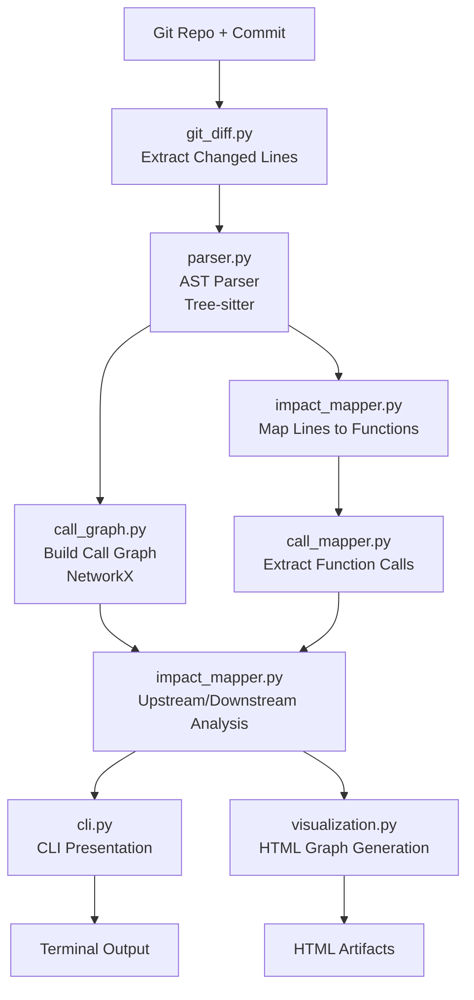

# ImpactScope

**ImpactScope** is a developer-first **Change Impact Analysis (CIA)** tool for large C codebases.

Given a Git commit (or diff), ImpactScope performs deterministic static analysis to answer a simple but expensive question:

> **For this change, what code is impacted — and what should I review or test?**

It bridges Git diffs, AST-level code structure, and call-graph analysis to compute the *blast radius* of a change, without relying on heuristics or AI hallucinations.

---

## Why ImpactScope Exists

In large C projects, even small changes can have non-obvious downstream effects:

- A modified helper function may impact dozens of callers
- A seemingly local refactor can propagate across modules
- Running the full test suite is slow and often unnecessary

Industrial tools (e.g. certification-grade Change Impact Analysis systems) solve this problem, but are:

- Enterprise-focused
- GUI-heavy
- Closed-source
- Expensive and hard to integrate into modern CI workflows

**ImpactScope focuses on the same core problem, but with a developer-first mindset.**

---

## Current Capabilities

- Commit-aware change detection (Git diff parsing)
- Line-to-function mapping via AST (Tree-sitter)
- Function-level call graph construction
- **Downstream impact analysis** (functions called by a change)
- **Upstream impact analysis** (functions that call into a change)
- Depth-limited traversal to control noise
- Basic standard-library filtering
- CLI-first workflow
- Optional HTML call-graph visualization

---

## Installation

### Requirements

- Python **3.10+**
- Git
- A C repository to analyze

### Setup (recommended: `uv`)

```bash
uv sync
```

This installs dependencies from `pyproject.toml` and manages the virtual environment automatically.

Alternatively, using a virtual environment:

```bash
python -m venv .venv
source .venv/bin/activate   # Linux / macOS
# or .\.venv\Scripts\Activate.ps1 on Windows
pip install -e .
```

---

## Usage

Run ImpactScope against a repository and a commit:

```bash
uv run main.py --repo-path ../your-c-project --commit HEAD
```

### Common options

- `--repo-path` *(required)*: Path to the target Git repository
- `--commit` *(required)*: Commit hash or ref to analyze
- `--depth` *(optional, default=1)*: Call graph traversal depth
- `--visualize` *(optional)*: Generate an HTML call graph under `artifacts/`
- `--output` *(optional, default=text)*: Output format — `text` for terminal-friendly output, `json` for machine-readable JSON

If a commit contains no relevant C changes, ImpactScope reports this explicitly.

### JSON Output

When using `--output json`, ImpactScope emits a structured JSON document suitable for CI, automation, and downstream tooling:

```bash
uv run main.py --repo-path ../your-c-project --commit HEAD --output json
```

**JSON Schema:**

```json
{
  "schema_version": "1.0.0",
  "repo_path": "../your-c-project",
  "commit": "HEAD",
  "depth": 1,
  "files": [
    {
      "file": "src/foo.c",
      "changed_functions": ["foo", "bar"],
      "downstream": ["baz", "qux"],
      "upstream": ["main"],
      "depth": 1,
      "changed_lines": [
        {"start": 10, "end": 15},
        {"start": 20, "end": 25}
      ]
    }
  ]
}
```

**Fields:**
- `schema_version`: Version of the output schema for compatibility tracking
- `repo_path`: Repository path that was analyzed
- `commit`: Commit hash or ref that was analyzed
- `depth`: Analysis depth used
- `files`: Array of per-file impact analysis results
  - `file`: Source file path relative to repository root
  - `changed_functions`: Functions directly affected by the commit
  - `downstream`: Functions potentially impacted downstream (called by changed functions)
  - `upstream`: Functions calling into the changed code
  - `changed_lines`: Line ranges that changed (optional, included when available)

### Example output

```text
src/auth/auth.c  Changed lines: [(5, 10)]
login_user
┣━━ Upstream (calls this function)
┃   ┗━━ handle_request
┗━━ Downstream (called by this function)
    ┣━━ connect_db
    ┣━━ printf
    ┗━━ query_user

src/net/net.c  Changed lines: [(3, 8)]
handle_request
┣━━ Upstream (calls this function)
┃   ┗━━ main
┗━━ Downstream (called by this function)
    ┣━━ login_user
    ┗━━ printf
```

This shows both **who depends on the changed function** (upstream) and **what it depends on** (downstream), giving a concrete view of how a change propagates through the system.

---

## Architecture Overview

ImpactScope processes C code changes in a structured pipeline, from diff analysis to impact visualization:




The pipeline flow:

1. **Git diff analysis** – Identify changed files and line ranges
2. **AST parsing** – Locate functions and call expressions using Tree-sitter
3. **Impact mapping** – Map changes to functions and propagate through calls
4. **Graph modeling** – Represent relationships using NetworkX
5. **Presentation** – Expose results via a clean CLI interface (and optional HTML graph)

Key modules:

- `git_diff.py` – Commit-aware diff extraction
- `parser.py` – Tree-sitter–based C parser
- `impact_mapper.py` – Maps code changes to functions and computes upstream/downstream impact
- `call_mapper.py` – Extracts function call relationships
- `call_graph.py` – Graph construction utilities
- `visualization.py` – PyVis-based HTML visualization of the call graph
- `cli.py` – User-facing command-line interface

---

## Design Philosophy

- **Determinism over magic**
- **Static analysis first, AI second**
- **Explainability over prediction**
- **Project-level reasoning over file-level diffs**
- **CLI and automation over GUI-heavy workflows**

This approach mirrors how industrial Change Impact Analysis tools are built, while remaining lightweight and developer-friendly.

---

## Roadmap / Future Work

ImpactScope is intentionally built as a foundation. Planned and possible extensions include:

### Short-term / Near-term

- Multi-file / cross-module graph merging
- Noise reduction heuristics
- Structured JSON output for CI usage
- Test impact heuristics

### Medium-term

- Lightweight requirement trace tags (e.g. comments in code)
- Richer interactive call graphs and summaries
- Comparison of impact across commits

### Long-term / Exploratory

- AI-assisted explanations:
  - Why a change is risky
  - What reviewers should focus on
- Support for additional languages (e.g., C++)

---

## Status

ImpactScope is currently a **working prototype** under active development.

The focus so far has been on **correctness, clarity, and architectural soundness** rather than feature completeness. The goal is to evolve ImpactScope into a **portfolio-grade Change Impact Analysis tool** that demonstrates:

- Static analysis fundamentals
- Call graph reasoning
- Deterministic tooling design
- Realistic CI and developer workflows

---

## Inspiration

This project is inspired by **industrial Change Impact Analysis (CIA) tools** used in large-scale and safety-critical systems (e.g., certification-grade static analysis platforms), but is intentionally focused on **developer-first workflows, open tooling, and CI-friendly usage**.

---

## Disclaimer

ImpactScope is not intended for certification or compliance use. It is a research and engineering project designed to explore *correct* approaches to change impact analysis.
