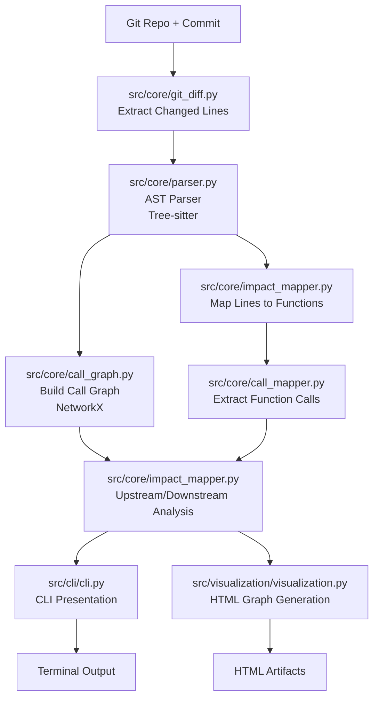

# Architecture Overview

ImpactScope processes C code changes in a structured pipeline, from diff analysis to impact visualization. This document explains the technical architecture, data flow, and design decisions.

## Pipeline Overview

## Core Components

### Git Integration (`src/core/git_diff.py`)

**Purpose**: Extract and parse Git diffs to identify changed code.

**Key Functions**:
- `get_commit_diff()`: Retrieves diff for a specific commit
- `parse_diff_lines()`: Extracts changed line ranges per file
- `filter_c_files()`: Focuses analysis on C source files

**Design Decisions**:
- Uses GitPython for robust Git operations
- Handles binary files and non-C changes gracefully
- Supports any commit reference (hash, branch, tag)

### AST Parser (`src/core/parser.py`)

**Purpose**: Parse C code into abstract syntax trees for analysis.

**Key Technologies**:
- **Tree-sitter**: Fast, incremental parsing library
- **tree-sitter-c**: C language grammar
- **tree-sitter-languages**: Multi-language support foundation

**Key Functions**:
- `parse_file()`: Parse a single C file into AST
- `extract_functions()`: Find all function definitions
- `extract_function_calls()`: Find all function calls within functions

**Design Decisions**:
- Tree-sitter chosen for speed and accuracy over regex-based approaches
- Incremental parsing enables efficient re-analysis
- Language-agnostic architecture supports future language extensions

### Call Graph Construction (`src/core/call_graph.py`)

**Purpose**: Build mathematical graph representation of function relationships.

**Key Technologies**:
- **NetworkX**: Python graph library for analysis algorithms
- **Directed Graphs**: Model caller-callee relationships

**Key Functions**:
- `build_call_graph()`: Construct NetworkX DiGraph from parsed functions
- `add_function_node()`: Add function nodes with metadata
- `add_call_edge()`: Add directed edges for function calls

**Design Decisions**:
- NetworkX chosen for its rich algorithm library
- Graph representation enables complex analysis queries
- Metadata storage supports visualization and filtering

### Impact Mapping (`src/core/impact_mapper.py`)

**Purpose**: Map code changes to functions and propagate impact through call graph.

**Key Functions**:
- `map_changes_to_functions()`: Associate changed lines with function definitions
- `compute_upstream_impact()`: Find functions calling changed code
- `compute_downstream_impact()`: Find functions called by changed code
- `traverse_with_depth()`: Control analysis scope via depth limiting

**Algorithm**:
1. Map changed line ranges to containing functions
2. For upstream analysis: Find all functions that call impacted functions
3. For downstream analysis: Find all functions called by impacted functions
4. Apply depth limiting to control noise vs completeness tradeoff

**Design Decisions**:
- Separate upstream/downstream analysis for different use cases
- Depth limiting prevents analysis explosion in large codebases
- Deterministic algorithms ensure reproducible results

### Call Mapping (`src/core/call_mapper.py`)

**Purpose**: Extract function call relationships from AST.

**Key Functions**:
- `extract_calls_from_function()`: Find all calls within a function body
- `resolve_call_targets()`: Map call expressions to function definitions
- `build_call_relationships()`: Create caller-callee mappings

**Design Decisions**:
- AST-based analysis more accurate than regex patterns
- Handles complex expressions and indirect calls
- Supports both direct function calls and function pointers

## Output Layer

### CLI Interface (`src/cli/cli.py`)

**Purpose**: Provide clean command-line interface and output formatting.

**Key Technologies**:
- **Typer**: Modern Python CLI framework
- **Rich**: Terminal formatting and tree display

**Key Features**:
- Type-safe argument parsing
- Colored terminal output
- Tree-structured impact display
- Progress indicators for long operations

### JSON Output (`src/output/json_output.py`)

**Purpose**: Generate machine-readable output for automation.

**Key Features**:
- Structured schema for reliable parsing
- Versioned output format
- Comprehensive metadata inclusion
- CI/CD and tooling integration support

### Visualization (`src/visualization/visualization.py`)

**Purpose**: Generate interactive HTML call graphs.

**Key Technologies**:
- **PyVis**: Network visualization library
- **Vis.js**: Interactive graph rendering
- **HTML/CSS/JavaScript**: Self-contained artifacts

**Key Features**:
- Interactive node exploration
- Physics-based layout
- Color-coded impact highlighting
- Self-contained HTML files

## Design Philosophy

### Determinism Over Magic

- All analysis is deterministic and reproducible
- Same input always produces same output
- No heuristics or approximations in core logic

### Static Analysis First

- Pure static analysis without execution
- No runtime dependencies or dynamic linking
- Analysis based solely on source code structure

### Explainability Over Prediction

- Clear reasoning for all impact conclusions
- Transparent algorithms and data flow
- No "black box" ML predictions

### Project-Level Reasoning

- Considers entire codebase relationships
- Not limited to single-file diffs
- Cross-module dependency tracking

### CLI and Automation Over GUI

- Primary interface is command-line
- JSON output for machine integration
- Optional visualization as supplement

## Code Organization

ImpactScope follows a modular architecture with clear separation of concerns:

### Core Analysis (`src/core/`)

- `git_diff.py` – Commit-aware diff extraction and parsing
- `parser.py` – Tree-sitter–based C parser for AST analysis
- `impact_mapper.py` – Maps code changes to functions and computes impact propagation
- `call_mapper.py` – Extracts function call relationships
- `call_graph.py` – Graph construction and analysis utilities
- `constants.py` – Shared constants and configuration

### Utilities (`src/utils/`)

- `path_utils.py` – Cross-platform path handling and filename sanitization

### Output (`src/output/`)

- `json_output.py` – JSON serialization and formatting for CI/automation

### CLI (`src/cli/`)

- `cli.py` – Command-line interface and user interaction

### Visualization (`src/visualization/`)

- `visualization.py` – Optional HTML call graph generation

## Data Flow

1. **Git diff analysis** – Identify changed files and line ranges
2. **AST parsing** – Locate functions and call expressions using Tree-sitter
3. **Impact mapping** – Map changes to functions and propagate through calls
4. **Graph modeling** – Represent relationships using NetworkX
5. **Presentation** – Expose results via CLI interface and optional HTML graph

## Performance Considerations

- **Incremental parsing**: Tree-sitter enables efficient re-analysis
- **Lazy evaluation**: Only parse files that contain changes
- **Depth limiting**: Prevent exponential explosion in large codebases
- **Memory efficiency**: Process files sequentially rather than loading entire codebase

## Extensibility

The modular architecture supports several extension points:

- **Language support**: Additional parsers via tree-sitter grammars
- **Analysis algorithms**: New impact computation strategies
- **Output formats**: Additional serialization formats
- **Integration APIs**: REST APIs, language bindings, IDE plugins

## Error Handling

- **Graceful degradation**: Continue analysis when individual files fail
- **Clear error messages**: Actionable feedback for common issues
- **Validation**: Input validation at all pipeline stages
- **Logging**: Comprehensive logging for debugging and monitoring
